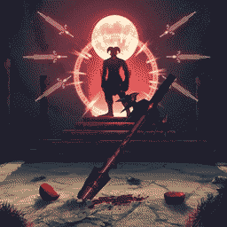

#  Blood Magic - Blessed Edition

Blood Magic is an arcane art that is practiced by mages who attempt to gather a vast amount of power through utilizing a forbidden material: blood. Even though it does grant a huge amount of power, every single action that is performed with this volatile magic can prove deadly. This is a fork of [Blood Magic: Alchemical Wizardry](https://www.curseforge.com/minecraft/mc-mods/blood-magic) by [WayofTime](https://www.curseforge.com/members/wayoftime) and aims to be the definitive 1.12.2 version of the mod. This version is "blessed" with updated dependencies, fixed bugs, and improved configurability.

## Current Changes

- switched build system to [RetroFuturaGradle](https://github.com/GTNewHorizons/RetroFuturaGradle)

## Planned Changes

- merge various fixes from [Universal Tweaks](https://www.curseforge.com/minecraft/mc-mods/universal-tweaks), [Magiculture Integrations](https://www.curseforge.com/minecraft/mc-mods/magiculture-integrations)
- make a lot of hardcoded values configureable
- replace the current guidebook with a [Patchouli](https://www.curseforge.com/minecraft/mc-mods/patchouli-rofl-edition) one

## [Ender-Development](https://github.com/Ender-Development)

Our Team currently includes:

- `_MasterEnderman_` - Project-Manager, Developer
- `Klebestreifen` - Developer

You can contact us on our [Discord](https://discord.gg/JF7x2vG).

## Contributing

Feel free to contribute to the project. We are always happy about pull requests.
If you want to help us, you can find potential tasks in
the [issue tracker](https://github.com/Ender-Development/Re-Emerging-Technology/issues).
Of course, you can also create new issues if you find a bug or have a suggestion for a new feature.
Should you have any questions, feel free to ask us on [Discord](https://discord.gg/JF7x2vG).

## Partnership with Akliz

> It's a pleasure to be partnered with Akliz. Besides being a fantastic server provider, which makes it incredibly easy
> to set up a server of your choice, they help me to push myself and the quality of my projects to the next level.
> Furthermore, you can click on the banner below to get a discount. :')

If you aren't located in the [US](https://www.akliz.net/enderman), Akliz now offers servers in:

- [Europe](https://www.akliz.net/enderman-eu)
- [Oceania](https://www.akliz.net/enderman-oce)
